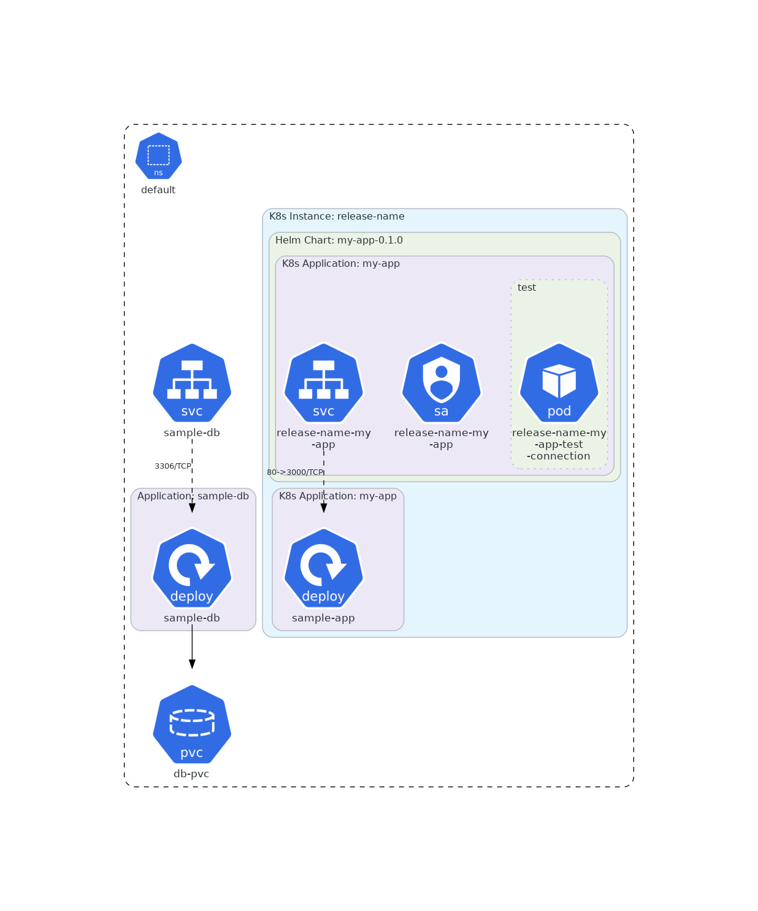

# Ynov project k8s

## Install

### Requirements

* A kubernetes cluster (tested with 1.34+)
* A working CCM, CSI Provisioner and Ingress Controller, see [CLUSTER-CONFIG.md](./docs/CLUSTER-CONFIG.md) for more information.
* A read-only token on docker.io

### Procedure

Create the docker pull secret with
```bash
kubectl create ns todo-list
kubectl -n todo-list create secret docker-registry mon-secret --docker-server=docker.io --docker-username=mxmtr86 --docker-password=TOKEN
```

Deploy the latest version of the app with
```bash
helm -n todo-list upgrade --install myapp .
```

## Architecture



Generate new diagrams with [kube-diagrams](https://github.com/philippemerle/KubeDiagrams).

```bash
helm template . | kube-diagrams  - -o docs/components.png
```
